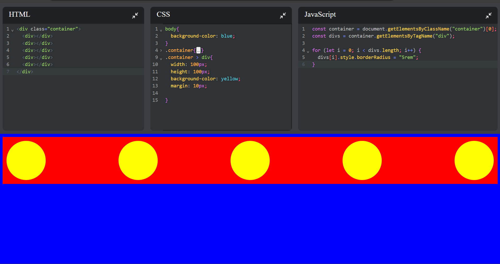

# 🧠 Code Editor - React-based Code Playground

Welcome to the **Code Editor**, a minimalist, performant, and beautiful web-based coding playground built using modern React practices. It features **real-time code editing**, **local persistence**, and an elegant UI powered by **CodeMirror** and **lucide-react** icons.

---

## 🚀 Features

- ✍️ **Real-Time Code Editing** with [CodeMirror](https://codemirror.net/)
- 💾 **Persistent Storage** using `localStorage` via a custom React Hook
- 🧠 **Stateful UI** with `useState` and `useEffect`
- 🎨 **Custom Styling** with pure CSS
- 🌈 **Clean and Modern UI** using `lucide-react` icons
- ⚡ Powered by [Vite](https://vitejs.dev/) for lightning-fast development

---

## 📁 Project Structure

```
code_editor/
├── public/
│   └── index.html                # HTML entry point
├── src/
│   ├── components/
│   │   └── Editor.jsx            # Main editor component
│   ├── hooks/
│   │   └── useLocalStorage.js    # Custom hook for persistent state
│   ├── App.jsx                   # Main app wrapper
│   ├── App.css                   # Custom styles
│   └── main.jsx                  # Entry point
├── package.json                  # Project dependencies and scripts
├── vite.config.js                # Vite configuration
└── README.md                     # Project documentation
```

---

## 🛠️ Tech Stack

| Tech             | Usage                           |
| ---------------- | ------------------------------- |
| **React**        | Component-based UI              |
| **Vite**         | Development bundler             |
| **CodeMirror**   | Code editor in the browser      |
| **Lucide-react** | Feather-like React icons        |
| **CSS**          | Styling the components          |
| **LocalStorage** | Save code even after refreshing |

---

## 🧠 Key Concepts Demonstrated

- 🧩 **Custom React Hooks** (`useLocalStorage`)
- 🔁 **Side-effects & State Management** with `useEffect` and `useState`
- ♻️ **Reusable UI Components**
- 🗂️ **Clean and Scalable Folder Structure**
- 💡 **Editor State Persistence**
- ⚙️ **Developer Experience Optimization** using Vite

---

## 📸 Screenshot

> Example:
>
> <a href="./code_editor/public/image.png" target="_blank">
>   
> </a>

---

## 📦 Setup Instructions

```bash
# Clone the repository
git clone <https url>
cd code_editor

# Install dependencies
npm install

# Start the development server
npm run dev
```

Visit `http://localhost:5173/` to start coding instantly!

## ✨Happy Learning!
